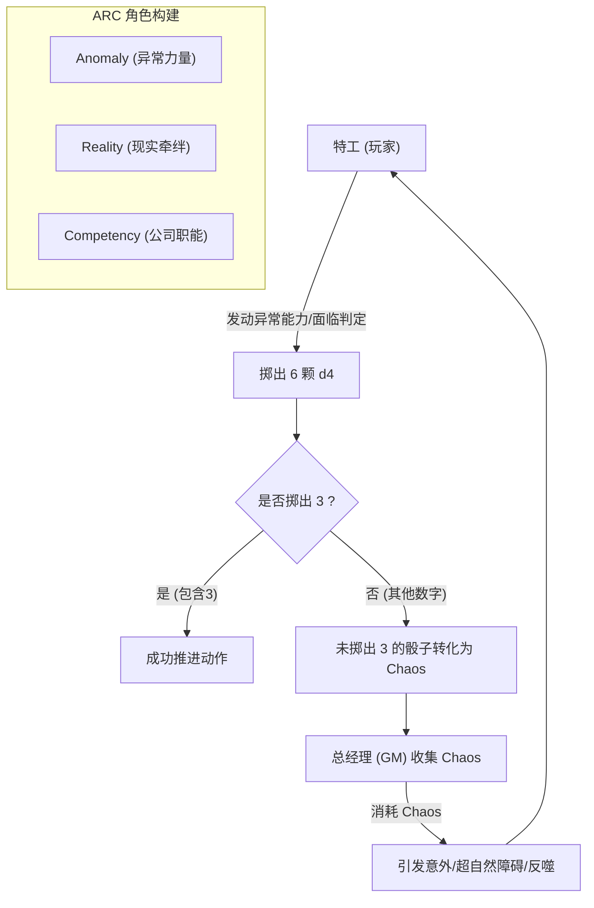

# 桌面扮演（TRPG）与《三角机构（Triangle Agency）》知识库

## 1. 桌面角色扮演游戏（TRPG）与论坛跑团基础

### 什么是 TRPG？
桌面角色扮演游戏（Tabletop Role-playing game，简称 TRPG），通俗来讲就是“进阶版的过家家”。在游戏中：
- **玩家（PL - Player）**：负责创建并扮演一个角色（PC - Player Character），如调查员、特工、魔法师等，在给定的世界观下展开冒险。
- **主持人（GM - Game Master / KP - Keeper 等）**：负责描绘场景、扮演非玩家角色（NPC）、推进剧情，并根据规则对玩家的行动作出判定和反馈。
- **核心机制**：通常通过**掷骰子（Dice）**的随机性来决定玩家行动的成功与否（即“检定”），为故事增添未知与乐趣。

### 什么是论坛跑团（Play-by-Post / 文字团）？
论坛跑团是 TRPG 的一种文字化、异步进行的游玩方式。它的特点包括：
- **异步文字交流**：玩家不需要在同一时间聚在一起，通过在论坛、贴吧或群组中发帖留言（Post）来轮流进行行动描述。
- **强烈的角色扮演（RP）属性**：由于采用文字形式，玩家有更多时间来雕琢自己的语言和动作描写，代入感和戏剧性往往更强。
- **行动格式约定**：通常玩家会使用特殊的括号（如 `【调查房间】`、`【打开箱子】`）来标明实质性的动作，方便主持人识别并给出反馈结果。
- **线上工具辅助**：借助在线的骰子机器人（Dice Bot）、人物卡生成器等工具来完成游戏内的机制运算。

---

## 2. 《三角机构（Triangle Agency）》深度解析

《三角机构（Triangle Agency）》是 Haunted Table Games 开发的一款结合了**企业官僚主义、超自然恐怖与办公室喜剧**的现代设定 TTRPG。灵感来源于《SCP基金会》、《Control》（控制）以及美剧《人生切割术》（Severance）。

### 背景设定
- **异常（Anomalies）**：超自然的扭曲力量，不断威胁着普通市民的现实生活。
- **三角机构（The Agency）**：一家渗透进各行各业的神秘跨国大企业。其表面上是处理各种杂务的垄断集团，暗地里则负责收容和控制“异常”。
- **外勤特工（Field Agents）**：玩家扮演的角色。特工们不仅要与异常力量结合获取超能力，前往各地执行任务（收容异常、清理“烂摊子”），还要面对令人窒息的职场压力、官僚作风以及自己在现实生活中的个人牵绊。

### ARC 角色构建系统
游戏没有传统的属性值设定，而是采用了极具特色的 **ARC 系统**（具有 729 种可能的初始组合）：
- **Anomaly（异常）**：与你绑定的超自然力量，赋予你扭曲现实的能力。
- **Reality（现实）**：你在现实世界中的生活、人际关系和世俗义务（通常由其他玩家扮演）。你必须在拯救世界和维持日常生活中寻找平衡。
- **Competency（职能）**：机构分配给你的岗位和职责，代表了你在公司内的职场角色与专长。

### 独特的 6d4 骰子与 Chaos（混乱）系统
《三角机构》的判定机制非常轻量且高度契合其主题：
- **使用 d4（四面骰）**：由于 d4 形状是三角形的，完美贴合“三角”机构的品牌调性。
- **固定骰池**：玩家每次需要检定时，固定投掷 **6颗 d4**（6 也是 3 的倍数，贯彻“三角”美学）。
- **判定成功**：只要这 6 颗骰子中有一颗结果是 **3**，即算作行动成功。如果有多个 3，则可能获得额外加成效果。
- **混乱机制（Chaos）**：所有**没有掷出 3** 的骰子，都会产生“混乱（Chaos）”。游戏主持人（在本作中被称为**总经理 General Manager**，简称 GM）会收集这些 Chaos 点数。
- **反噬与障碍**：GM 可以消耗积攒的 Chaos 点数，在故事中引入超自然障碍、引发意外或者让特工遭到能力的负面反噬。

---

## 3. 《三角机构》核心机制流转图

通过下方的流程图，可以直观地理解《三角机构》中特工行动与混乱反噬的运作循环：

